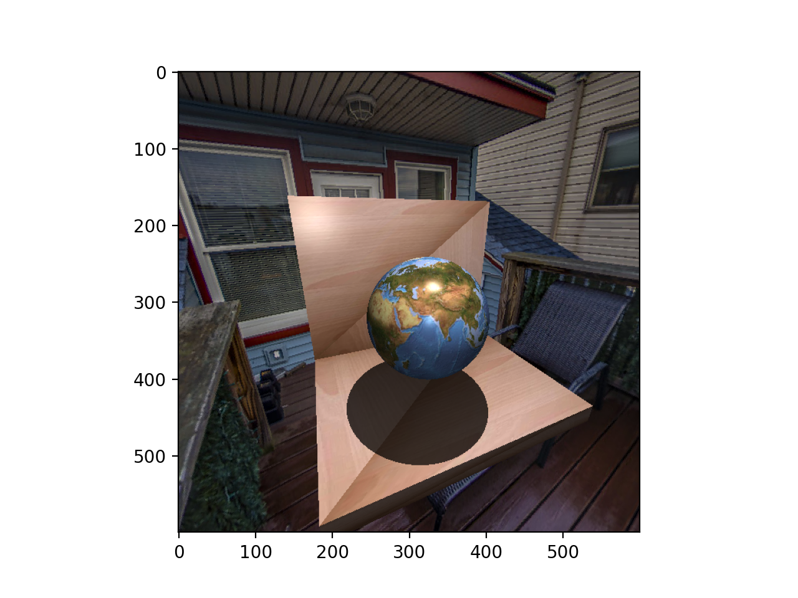

# Fundamentals of Computer Graphics

This repository has a set of assignments for the Fundamentals of Computer Graphics course @ PUC-Rio M.Sc. program (2022.1).

In this course, we explored fundamentals of CG such as linear algebra for 360 environments and camera positioning, rendering with ray tracing of convex polygons, mirroring, textures and shadows.

  

